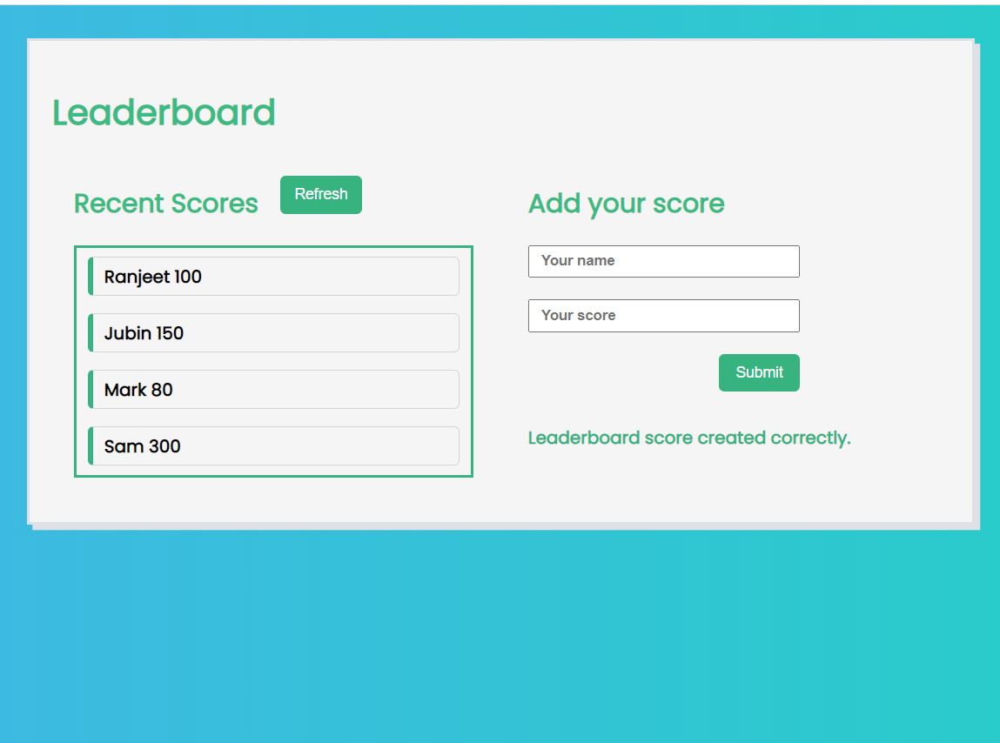
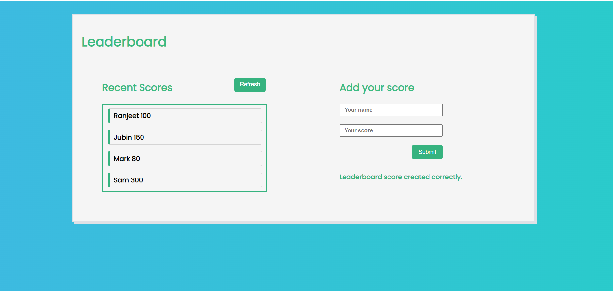

# Leaderboard

> Leaderboard is project based on APIs, that shows list of player with name and score, Users can add their score using add score scection. Data is send and retrived from APIs.

## Screenshots:

### mobile

### desktop

Project's features are added into seperate branch to keep main branch safe.

## Built With

- HTML
- CSS
- JavaScript
- Webpack
- APIs

## Online live link

[Visit project online](https://thecodechaser.github.io/leaderboard/dist/)

## Getting Started

To get a local copy up and running follow these simple example steps.

### Using it Locally
- Clone the project from GitHub [here](git@github.com:thecodechaser/leaderboard.git)
- Run the following commands as listed in your terminal:
- `npm install`
- `npm run build`
- `npm start`

## Visit And Open Files

[Visit Repo](https://github.com/thecodechaser/leaderboard)

## Download Repo

[Download Repo](https://github.com/thecodechaser/leaderboard/archive/refs/heads/dev.zip)

## Authors

👤 **Ranjeet Singh**

- GitHub: [@githubhandle](https://github.com/thecodechaser)
- Twitter: [@twitterhandle](https://twitter.com/thecodechaser)
- LinkedIn: [LinkedIn](https://linkedin.com/in/thecodechaser)

## 🤝 Contributing

Contributions, issues, and feature requests are welcome!

Feel free to check the [issues page](https://github.com/thecodechaser/leaderboard/issues).

## Show your support

Give a ⭐️ if you like this project!

## Acknowledgments

- Inspiration: Microverse

## 📝 License

This project is [MIT](./MIT.md) licensed.
